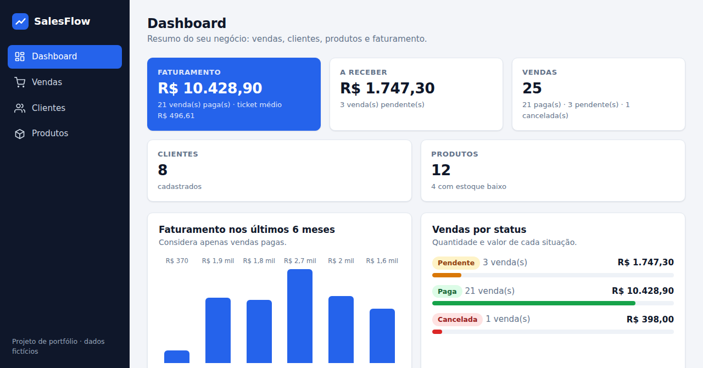
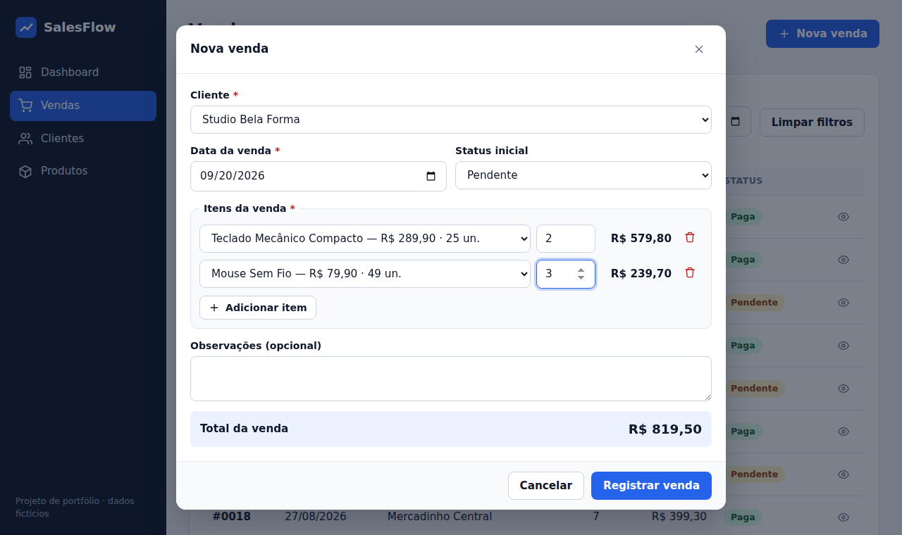
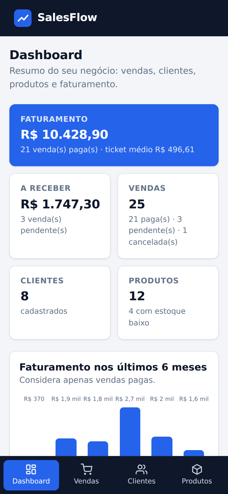

# SalesFlow

Sistema web de **gestão comercial** para pequenos negócios e vendedores autônomos: cadastro de clientes e produtos, registro de vendas com controle de estoque e um dashboard com os principais números do negócio.

Projeto de portfólio feito com **HTML, CSS e JavaScript puro** (sem frameworks), com foco em código organizado e fácil de explicar.

**Demonstração online:** https://ruangdev0-ux.github.io/salesflow/



<p>
  
  
</p>

> Todos os dados exibidos na demonstração (clientes, produtos e vendas) são **fictícios**.

## Problema que o projeto procura resolver

Muitos vendedores e pequenos comércios ainda controlam clientes, preços e vendas em cadernos ou planilhas soltas. Isso dificulta responder perguntas simples: *quanto faturei este mês? quais vendas ainda estão pendentes? qual produto está acabando? quanto cada cliente já comprou?*

O SalesFlow reúne essas informações em um só lugar, com regras que evitam erros comuns (vender mais do que existe em estoque, apagar um cliente que já tem vendas, cadastrar dados inválidos).

## Funcionalidades

- **Dashboard:** faturamento (vendas pagas), valor a receber (pendentes), número de vendas, clientes e produtos, ticket médio, faturamento dos últimos 6 meses, vendas por status, últimas vendas, produtos mais vendidos e alerta de estoque baixo.
- **Clientes:** cadastrar, editar e excluir; busca por nome, e-mail, telefone ou cidade (ignora acentos e maiúsculas); mostra quantas compras e quanto cada cliente já comprou.
- **Produtos:** cadastrar, editar e excluir; busca por nome/categoria; filtros por categoria e situação do estoque; etiquetas de "estoque baixo" e "sem estoque".
- **Vendas:** registrar venda com vários itens, escolhendo cliente, data e status inicial; total calculado na hora; o estoque é descontado automaticamente.
- **Histórico de vendas:** lista da mais recente para a mais antiga, com busca (cliente, produto ou número), filtro por status, filtro por período e total do que está listado.
- **Status de venda:** `Pendente`, `Paga` e `Cancelada`, com transições controladas (pendente → paga ou cancelada; paga → cancelada; cancelada é final). Cancelar devolve os produtos ao estoque.
- **Validação de formulários:** mensagens de erro ao lado de cada campo (nome obrigatório, e-mail válido e único, telefone com DDD, preço maior que zero, estoque inteiro, quantidade dentro do estoque, data não futura etc.).
- **Tratamento de erros:** exclusões bloqueadas quando há vínculo com vendas, avisos quando o armazenamento do navegador está cheio/indisponível, proteção contra dados corrompidos e mensagem amigável se uma tela falhar ao carregar.
- **Persistência:** os dados continuam salvos ao atualizar a página ou fechar o navegador (veja [Como os dados são armazenados](#como-os-dados-são-armazenados)).
- **Dados de demonstração** carregados na primeira visita, com botões para restaurá-los ou apagar tudo.
- **Interface responsiva:** menu lateral no computador e barra de navegação inferior no celular; tabelas viram cartões em telas pequenas.
- **Acessibilidade básica:** navegação por teclado, rótulos nos campos, foco visível, `aria-live` nos avisos e janelas modais nativas (`<dialog>`).

## Tecnologias utilizadas

Somente o que existe no código do repositório:

| Tecnologia | Uso no projeto |
| --- | --- |
| **HTML5** | Estrutura da página e janelas modais com o elemento `<dialog>` |
| **CSS3** | Layout com Flexbox e Grid, variáveis CSS, media queries para o modo celular, gráficos de barras feitos só com CSS |
| **JavaScript (ES modules)** | Toda a lógica, dividida em módulos (`import`/`export`), sem bibliotecas nem frameworks |
| **`localStorage`** | Armazenamento dos dados no navegador |
| **API `Intl`** | Formatação de moeda em reais (`pt-BR`) |
| **`node:test`** (Node.js) | Testes unitários da lógica de negócio (`npm test`) |
| **GitHub Actions + GitHub Pages** | Executa os testes e publica o site a cada push na `main` |

Não há back-end, banco de dados externo, APIs de terceiros nem serviços pagos. Os ícones são SVG inline (traçado no estilo do conjunto Feather Icons, licença MIT) e a fonte é a padrão do sistema, então o site não faz nenhuma requisição externa.

## Como os dados são armazenados

O SalesFlow é uma aplicação **100% no navegador**. Os dados são convertidos em JSON e guardados no `localStorage`, em três chaves: `salesflow.v1.clients`, `salesflow.v1.products` e `salesflow.v1.sales`.

Consequências importantes (e honestas):

- os dados ficam **apenas no navegador e no dispositivo** em que foram criados; não há sincronização entre aparelhos nem entre pessoas;
- limpar os dados do site no navegador apaga tudo;
- não existe login: quem abrir o site vê o próprio conjunto de dados, começando pelos dados de demonstração.

Isso é uma escolha consciente para permitir publicação gratuita no GitHub Pages sem servidor. Para uso real com várias pessoas seria necessário um back-end e um banco de dados (veja [Próximos passos](#próximos-passos)).

## Estrutura do projeto

```
salesflow/
├── index.html                # Página única: casca do app (menu, área principal, avisos)
├── css/
│   ├── base.css              # Cores/variáveis, reset, tipografia, acessibilidade
│   ├── layout.css            # Menu lateral, grades, versão celular do layout
│   └── components.css        # Botões, cartões, tabelas, formulários, modais, gráficos
├── js/
│   ├── main.js               # Ponto de entrada: cria storage, db e inicia o roteador
│   ├── router.js             # Navegação entre telas usando o hash da URL (#/vendas)
│   ├── data/                 # CAMADA DE DADOS
│   │   ├── storage.js        #   leitura/gravação no localStorage + tratamento de erros
│   │   ├── repository.js     #   CRUD genérico (add, get, update, remove) de uma coleção
│   │   ├── db.js             #   junta clientes, produtos e vendas; carga da demonstração
│   │   └── seed.js           #   dados fictícios de demonstração
│   ├── services/             # REGRAS DE NEGÓCIO (sem código de tela)
│   │   ├── constants.js      #   status de venda, transições permitidas, limite de estoque baixo
│   │   ├── validators.js     #   validação de cliente, produto e venda
│   │   ├── sales.js          #   registrar venda, mudar status, devolver estoque
│   │   ├── deletion.js       #   regras para excluir cliente/produto
│   │   └── queries.js        #   buscas, filtros e cálculos do dashboard
│   ├── ui/                   # PEÇAS DE INTERFACE REUTILIZÁVEIS
│   │   ├── dialog.js         #   janelas modais (formulário, informação, confirmação)
│   │   ├── forms.js          #   campos de formulário e exibição de erros
│   │   ├── components.js     #   cabeçalho de página, etiqueta de status, estado vazio
│   │   ├── toast.js          #   avisos de sucesso/erro
│   │   └── icons.js          #   ícones SVG
│   ├── utils/
│   │   ├── html.js           #   template seguro que escapa HTML (evita XSS)
│   │   └── format.js         #   moeda, datas, telefone, conversão de preço, normalização de texto
│   └── views/                # TELAS
│       ├── dashboard.js
│       ├── clients.js
│       ├── products.js
│       └── sales.js
├── tests/                    # Testes unitários (node:test)
├── assets/                   # Ícone do site e imagem de pré-visualização
├── docs/                     # Imagens usadas neste README
├── .github/workflows/deploy.yml
└── package.json
```

### Como as camadas conversam

```
views  →  services  →  data  →  localStorage
(tela)    (regras)     (CRUD)     (navegador)
```

A tela nunca acessa o `localStorage` diretamente e as regras de negócio não conhecem HTML. Por isso é possível testar `services/` e `data/` no Node.js, sem abrir um navegador.

## Como executar

Não há etapa de build nem dependências para instalar.

Como o projeto usa módulos ES (`import`), o navegador não os carrega abrindo o `index.html` com duplo clique (`file://`). Sirva a pasta com qualquer servidor estático:

```bash
git clone https://github.com/ruangdev0-ux/salesflow.git
cd salesflow

# opção 1: Python
python3 -m http.server 8080

# opção 2: Node.js
npx serve .
```

Depois abra `http://localhost:8080` (Python) ou o endereço mostrado pelo `serve`.

### Testes

Requer Node.js (os testes foram executados com a versão 22):

```bash
npm test
```

Os testes cobrem: conversão e formatação de dinheiro/datas, escape de HTML, validações, registro e cancelamento de venda (total, número sequencial, estoque), regras de exclusão, transições de status, buscas e filtros, cálculos do dashboard, armazenamento (inclusive JSON corrompido e falha de gravação) e coerência dos dados de demonstração. Os fluxos de tela (cadastros, vendas, filtros, layout desktop e celular) foram verificados manualmente em navegador durante o desenvolvimento.

## Deploy

O workflow `.github/workflows/deploy.yml` roda os testes e, se passarem, publica no GitHub Pages os arquivos públicos (`index.html`, `css/`, `js/`, `assets/`) a cada push na branch `main`. Para reproduzir em outro repositório: *Settings → Pages → Source: GitHub Actions*.

## Decisões de projeto

- **Dinheiro em centavos (inteiros):** evita erros de arredondamento de ponto flutuante (`0.1 + 0.2`).
- **Item de venda guarda nome e preço da época:** se o preço do produto mudar depois, o histórico mostra o valor realmente cobrado.
- **Integridade dos dados:** cliente ou produto que já aparece em alguma venda não pode ser excluído.
- **Estoque consistente:** registrar desconta, cancelar devolve; se a gravação falhar no meio, o estoque é restaurado.
- **HTML escapado por padrão:** o template `html` escapa tudo o que é digitado pelo usuário antes de inserir na página.
- **Datas como texto `AAAA-MM-DD`:** evita problemas de fuso horário e permite comparar períodos como texto.
- **Roteamento por hash (`#/vendas`):** funciona no GitHub Pages sem configuração de servidor.

## O que o projeto ajuda a praticar

- separar o código em camadas (dados, regras de negócio, interface) e em módulos ES;
- CRUD completo e persistência no navegador com `localStorage`;
- validação de formulários e mensagens de erro claras;
- funções puras e testes automatizados com o executor de testes nativo do Node.js;
- CSS responsivo (Flexbox, Grid, media queries) e noções de acessibilidade;
- manipulação do DOM, delegação de eventos e roteamento simples de uma SPA;
- publicação contínua com GitHub Actions e GitHub Pages.

## Limitações e próximos passos

Limitações atuais: dados só no navegador; sem login nem multiusuário; vendas não podem ser editadas (apenas ter o status alterado); sem exportação de relatórios.

Ideias para evoluir: back-end com API e banco de dados; autenticação; edição de vendas; exportar para CSV; descontos e formas de pagamento; testes automatizados de interface.

## Autor

**Ruan Gomes** — estudante de Análise e Desenvolvimento de Sistemas (Universidade de Franca), em busca de oportunidades de estágio em desenvolvimento de software.

- GitHub: [@ruangdev0-ux](https://github.com/ruangdev0-ux)
- LinkedIn: [linkedin.com/in/ruan-gomes-805029393](https://www.linkedin.com/in/ruan-gomes-805029393)
